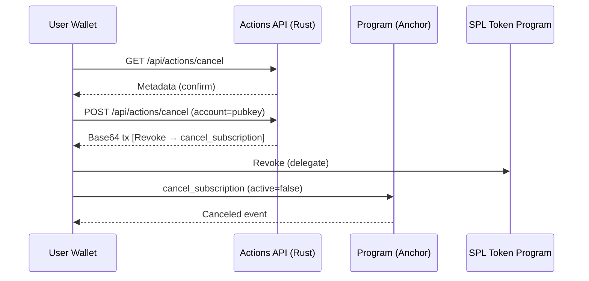

# Product Requirements Document — Tally (Blink‑Native Subscriptions, Solo‑Friendly MVP)

**Doc owner:** Roland Rodriguez (Govcraft)
**Date:** 2025‑09‑16
**Status:** Draft v1.1
**Repo:** `tally/` (full layout below)

### Repository layout (authoritative)

```
tally/
├─ README.md
├─ .env.example
├─ Anchor.toml
├─ Cargo.toml                          # workspace
├─ crates/
│  ├─ tally-sdk/                       # Rust SDK used by Actions API & CLI
│  │  ├─ Cargo.toml
│  │  └─ src/lib.rs                    # IDL loader, PDAs/ATAs, tx builders, memo helpers
│  └─ idl/
│     └─ tally_subs.json               # generated IDL (checked in for SDK)
├─ programs/
│  └─ tally-subs/                      # Anchor program (subscriptions core)
│     ├─ Cargo.toml
│     └─ src/
│        ├─ lib.rs
│        ├─ state.rs                   # Merchant, Plan, Subscription accounts
│        ├─ instructions/
│        │  ├─ init_merchant.rs
│        │  ├─ create_plan.rs
│        │  ├─ start_subscription.rs
│        │  ├─ renew_subscription.rs
│        │  ├─ cancel_subscription.rs
│        │  └─ admin_withdraw_fees.rs
│        └─ events.rs
├─ actions-api/                        # Unified Axum/Tower server (Solana Actions + Merchant Dashboard)
│  ├─ Cargo.toml
│  └─ src/
│     ├─ main.rs                       # router, CORS, actions.json, dashboard routes
│     ├─ routes/
│     │  ├─ subscribe_get.rs
│     │  ├─ subscribe_post.rs
│     │  ├─ cancel_get.rs
│     │  └─ cancel_post.rs
│     ├─ dashboard/                    # Merchant dashboard module
│     │  ├─ mod.rs                     # dashboard routing and state
│     │  ├─ auth.rs                    # wallet-based authentication
│     │  ├─ routes.rs                  # dashboard page handlers
│     │  ├─ api.rs                     # HTMX API endpoints
│     │  └─ templates.rs               # Askama template helpers
│     ├─ builders/
│     │  ├─ build_start_tx.rs          # ApproveChecked + start_subscription
│     │  └─ build_cancel_tx.rs         # Revoke + cancel_subscription
│     ├─ templates/                    # Askama templates (.html)
│     │  ├─ actions/                   # Action metadata templates
│     │  └─ dashboard/                 # Dashboard UI templates (Basecoat UI + HTMX)
│     ├─ static/                       # Static assets served by Axum
│     │  ├─ css/
│     │  │  ├─ basecoat.css            # vendored Basecoat build (no TS)
│     │  │  └─ dashboard.css           # minimal overrides (CSS variables)
│     │  └─ js/
│     │     └─ htmx.min.js             # vendored htmx (no frameworks)
│     └─ utils/                        # load IDL, memo, token program detection
├─ tally-keeper/                       # Off‑chain renewals
│     ├─ Cargo.toml
│     └─ src/
│        ├─ main.rs                    # loop: find_due → renew → backoff
│        ├─ fetch.rs                   # scans PDAs by next_renewal_at
│        ├─ renew.rs                   # builds + sends renew tx
│        └─ metrics.rs                 # Prometheus logs, alerts
├─ bins/
│  └─ tally-cli/                       # Rust clap CLI (merchant/dev commands)
│     ├─ Cargo.toml
│     └─ src/main.rs                   # init-merchant, create-plan, list, etc.
└─ tests/
   ├─ program.rs                        # Rust integration tests (localnet)
   ├─ tally-keeper.rs
   └─ actions_api.rs
```

**Folder responsibilities**

* **`programs/tally-subs`**: Anchor program implementing subscription logic using delegate‑based USDC transfers.
* **`tally-sdk`**: Rust library to load IDL, compute PDAs/ATAs, build signable transactions, and parse events/memos.
* **`actions-api`**: Unified Rust Axum service serving both Solana Actions metadata/transactions and merchant dashboard; includes wallet-based auth, SurrealDB integration, and HTMX-powered UI using **Basecoat UI** components (no TypeScript).
* **`tally-keeper`**: Renewal worker that scans due subscriptions and submits `renew_subscription` in batches; exposes Prometheus.
* **`cli`**: Rust clap utilities to initialize merchant, create plans, and inspect state via `tally-sdk`.
* **`tests`**: Integration tests for program, tally-keeper, and Actions API.

## 1) Executive summary (pyramid principle)

**Tally** is a Blink‑native subscription engine for Solana. Merchants post a Subscribe Blink; a user approves a bounded USDC allowance and is charged once immediately; the Keeper renews on schedule by pulling from that allowance. Cancel is one click via a Cancel Blink. Everything is standards‑based (Solana Actions, SPL Token delegate approvals) and wallet‑friendly.

We keep the model lean: a single on‑chain program (**tally‑subs**) tracks `Merchant`, `Plan`, and `Subscription` accounts; a unified Rust Actions API service composes wallet‑safe transactions (Approve → Start, Revoke → Cancel) and serves the merchant dashboard; a small Rust Keeper renews due subscriptions; the **tally‑sdk** crate centralizes IDL/PDA logic used by both **Actions API** and **tally‑cli**; the integrated **Merchant Dashboard** provides KPIs and link generation through HTMX-powered interfaces without TypeScript.

**Outcome:** A merchant can post a Tally Blink for "\$5 / 30 days" and collect recurring USDC with clear receipts, low friction, and no custom frontend.

---

## 2) Goals and non‑goals

**Goals**

1. Ship a working end‑to‑end subscription flow (Subscribe, Renew, Cancel) with USDC on Solana using only standard wallet primitives.
2. Provide distribution through Solana Actions/Blinks so merchants can sell from any link surface (X, Discord, websites).
3. Make operations safe and observable: clear events, metrics, and failure handling for renewals and allowance shortfalls.
4. Keep a solo‑maintainable footprint (small program, tiny Actions API, tiny Keeper, shared SDK/types, CLI).

**Non‑goals** (MVP)

* No multi‑chain bridging logic (document CCTP, don’t build).
* No fiat on‑ramp.
* No Token‑2022 membership gating or Transfer Hooks (reserved for V2).
* No complex pricing (no trials/proration/coupons). Single price per plan, fixed period, single mint (USDC).

---

## 3) Users, problems, and use cases

**Primary users**

* **Merchant:** creator, SaaS builder, or community selling recurring access; wants no‑code links, clean receipts, and visibility into failures.
* **Subscriber:** wallet user willing to approve a bounded allowance and revoke anytime; expects one‑tap subscribe/cancel and clear USDC charges.

**Problems today**

* Most on‑chain recurring systems require custom UI or custodial pull models.
* Users dislike opaque debits; merchants struggle with failed renewals tracking.
* Distribution is weak without native link unfurls.

**Use cases**

* Creator posts a “Pro Access \$5/month” Blink across social platforms.
* SaaS CLI unlock using a membership check (off‑chain) that maps to an on‑chain Subscription.
* Private Discord/Telegram access where the bot reads on‑chain state to permit/deny.

---

## 4) Narrative user journeys

**Subscribe**
A user taps a Subscribe Blink → wallet unfurls the Action → GET returns metadata showing plan name and price → POST returns a complete transaction with two instructions: `ApproveChecked` (delegate = program PDA, allowance = 3× price) then `start_subscription` (initial charge and create Subscription). The wallet signs once; the subscription is active and `next_renewal_ts` is set.

**Renew**
The Keeper scans for `active` subscriptions whose `next_renewal_ts` is due and within `grace_secs`. It submits `renew_subscription`. If the allowance or funds are insufficient, it records a failure reason and backs off while still in grace. On success, it bumps `next_renewal_ts` and increments `renewals`.

**Cancel**
The user taps a Cancel Blink. POST returns one transaction with `Revoke` (delegate) and `cancel_subscription` (flag inactive). The program never pulls again.

---

## 5) Full scope and requirements (comprehensive)

This section is complete and self‑contained. It replaces any external checklist.

### 5.1 Prereqs & Tooling (MVP)

* \[MUST] **Toolchain**: Rust stable, Anchor ≥ 0.30, Solana CLI ≥ 2.x, cargo-make (optional), justfile (optional).
* \[MUST] **Localnet/devnet** workflows (`solana-test-validator` with pre‑minted USDC).
* \[MUST] **.env** keys for Actions, Keeper, Dashboard, and CLI (see §10).
* \[SHOULD] Dockerfiles for Actions, Keeper, Dashboard; `anchor test` runs headless.
* \[SHOULD] One‑command bootstrap scripts: `make local-up`, `make demo`.

**Done when**: a clean clone can run `cargo run -p actions-api` and hit GET/POST endpoints against local validator.

### 5.2 On‑Chain Program (Anchor)

* \[MUST] Instructions: `init_merchant`, `create_plan`, `start_subscription`, `renew_subscription`, `cancel_subscription`, `admin_withdraw_fees`.
* \[MUST] PDAs:

  * **Merchant \[`merchant`, authority]**: `authority`, `usdc_mint`, `treasury_ata`, `platform_fee_bps` (0–1000), `bump`.
  * **Plan \[`plan`, merchant, plan\_id]**: `price_usdc` (u64), `period_secs` (u64), `grace_secs` (u64), `name` (≤32B), `active` (bool).
  * **Subscription \[`sub`, plan, subscriber]**: `next_renewal_ts` (i64), `active` (bool), `renewals` (u32), `created_ts` (i64), `last_amount` (u64), `bump`.
* \[MUST] Event emits: `Subscribed`, `Renewed`, `Canceled`, `PaymentFailed{reason}`.
* \[MUST] **Mint pinning** and strict ATA checks. Classic SPL Token only in MVP.

### 5.3 Instruction Rules & Guardrails

* `init_merchant`: signer = `authority`; `treasury_ata` must match `usdc_mint`; `platform_fee_bps ≤ 1000`.
* `create_plan`: `price_usdc > 0`, `period_secs ≥ 24h`, `grace_secs ≤ 2×period`; immutable price; `active` can be toggled.
* `start_subscription`: requires prior `ApproveChecked` (delegate = program PDA) with allowance ≥ `price × allowance_periods` (default 3). Performs two CPI transfers (merchant, platform), sets `next_renewal_ts = now + period` and emits `Subscribed`. Idempotent within slot.
* `renew_subscription`: valid only when due and within grace; updates timestamps, increments `renewals`, emits `Renewed`. Distinct errors: `InsufficientAllowance`, `InsufficientFunds`, `PastGrace`, `Inactive`.
* `cancel_subscription`: sets `active=false`; emits `Canceled`; no funds moved. The Cancel Blink also posts a SPL `Revoke`.
* `admin_withdraw_fees`: platform authority only; transfers USDC from platform ATA to treasury.

### 5.4 Security Requirements

* Delegate allowance is used **only** inside start/renew; no generic spending.
* Strict seeds/signers; checked arithmetic for fee math (`price*bps/10_000`).
* Idempotency nonce to prevent double charges in same slot.
* Program holds no SOL; transfers are USDC only.

### 5.5 Actions/Blinks API

* Routes: `GET/POST /api/actions/subscribe/:merchant/:plan` and `GET/POST /api/actions/cancel/:merchant/:plan`.
* `actions.json` at root; permissive CORS; responses conform to `@solana/actions` schema.
* POST Subscribe returns a **single** base64 transaction: `ApproveChecked` → `start_subscription` (+ optional `Memo`).
* POST Cancel returns `Revoke` → `cancel_subscription` (+ optional `Memo`).
* Inputs include `{ account: <subscriberPubkey> }`; server computes PDAs/ATAs and detects token program.
* Rate limits + structured errors `{ code, message, hint }`.

### 5.6 Keeper (Renewal Cron)

* Scans `Subscription` PDAs due within grace; batches renewals with bounded concurrency.
* Exponential backoff; reason‑coded failures; optional Jito tips per tx.
* Prometheus metrics: `subs_due_total`, `subs_renew_ok_total`, `subs_renew_fail_total{reason}`, `keeper_loops_total`, `rpc_errors_total`, `tip_lamports_sum`, latency histograms.

### 5.7 Tally SDK (Rust)

* **Crate:** `tally-sdk`
* Responsibilities:

  * Load IDL and construct Anchor program clients.
  * Compute PDAs (`Merchant`, `Plan`, `Subscription`) and ATAs.
  * Detect token program (classic vs 2022) from mint and build `approve/transfer_checked` ix.
  * Build **Approve → Start** and **Revoke → Cancel** transactions.
  * Parse events and memos to structured receipts.
* Consumers: `services/actions-api`, `bins/tally-cli`, and integration tests.

**Done when**: Actions API & CLI compile solely against `tally-sdk`; no duplicated helpers.

### 5.8 CLI (tally-cli)

* **Crate:** `bins/tally-cli` (Rust, clap)
* Commands: `init-merchant`, `create-plan`, `list-plans`, `list-subs`, `deactivate-plan`, `withdraw-fees` with `--json` output.
* Uses `tally-sdk` for all chain interactions.

**Done when**: Merchant demo can be completed end‑to‑end using CLI + Actions.

### 5.9 Data & Fees

* Demo plan: `$5 / 30d` (`price_usdc=5_000_000`, `period_secs=2_592_000`, `grace_secs=432_000`).
* Platform fee taken as a separate transfer each charge; `last_amount` stored for audit.

### 5.10 Config

* Env keys for Actions and Keeper (details in §10) with single source of truth for `PROGRAM_ID`, `USDC_MINT`, treasuries.

### 5.11 Observability & Ops

* JSON logs with `service`, `event`, `plan`, `sub`, `txSig`.
* Grafana dashboard driven by Keeper metrics; alerts on failure rate, RPC spikes, stalled loop.

### 5.12 Testing

* Unit tests for all instruction constraints and error paths.
* E2E localnet test simulating Approve → Start → Keeper Renew → Cancel.
* Property tests for rounding; test matrix for varying allowance/grace/revokes.

### 5.13 Wallet & Blink Compatibility

* Works with at least one top wallet on devnet; tested unfurls in Blinks Inspector and Dialect registry; fallback deep link.

### 5.14 Docs & DX

* README quickstart; “How it works” sequence; revoke instructions; Merchant FAQ.

### 5.15 Risk & Fallbacks

* On `InsufficientAllowance`: emit event + provide Blink to increase allowance.
* On `InsufficientFunds`: record & retry until grace end; then mark failure.
* `Plan.active=false` halts new starts.

### 5.16 Demo DoD

* Merchant/plan created; Subscribe Blink signs one tx; two USDC transfers visible; Keeper renews; Cancel Blink revokes and deactivates.

---

## 6) Detailed functional requirements

**Merchant setup**

* Initialize merchant (authority, USDC mint, merchant treasury ATA, `platform_fee_bps`).
* Create multiple plans per merchant PDA (`plan_id` seeds).
* Plan fields: `price_usdc`, `period_secs`, `grace_secs`, `name`, `active`.

**Start (approve + charge)**

* Actions POST returns base64 transaction with SPL `ApproveChecked` (delegate = program PDA; allowance = `price × N`) then `start_subscription` (two transfers: merchant + platform).
* Sets `next_renewal_ts = now + period_secs`; emits `Subscribed`; idempotent within slot.

**Renew**

* Valid when due and within grace; on success updates timestamps, `renewals`, `last_amount`; emits `Renewed`.

**Cancel**

* Marks inactive and emits `Canceled`. Cancel Blink pairs SPL `Revoke` with `cancel_subscription`.

**Admin withdraw fees**

* Platform authority transfers USDC from platform ATA to treasury via `admin_withdraw_fees`.

**Errors and reasons**

* Distinct program errors: `InsufficientAllowance`, `InsufficientFunds`, `PastGrace`, `Inactive`, `WrongMint`, `BadSeeds`, `InvalidPlan`.

---

## 7) APIs (Actions/Blinks) — contract (complete, Rust)

We implement the Solana Actions spec directly in Rust (Axum). Responses mirror the public schema used by wallets; no TypeScript dependency.

### 7.1 Discovery

* Serve `actions.json` at site root with permissive CORS (`*`).
* Example content is unchanged; generated by the Rust service at startup.

### 7.2 Subscribe

* **GET** `/api/actions/subscribe/:merchant/:plan` → metadata (`title`, `icon`, `description`, action label like “Subscribe \$5 / 30d”).
* **POST** `/api/actions/subscribe/:merchant/:plan` → base64 transaction: `ApproveChecked` → `start_subscription` (+ optional `Memo`). Body: `{ account: <subscriberPubkey> }`.

### 7.3 Cancel

* **GET/POST** `/api/actions/cancel/:merchant/:plan` → base64 transaction: `Revoke` → `cancel_subscription` (+ optional `Memo`).

### 7.4 Errors & limits

* Structured errors `{ code, message, hint }`; suggested limits: 60/min GET, 20/min POST; GET cache 60s; POST no‑cache.

---

## 8) Data model (on‑chain)

**Merchant**

* `authority: Pubkey`
* `usdc_mint: Pubkey`
* `treasury_ata: Pubkey`
* `platform_fee_bps: u16`
* `bump: u8`

**Plan**

* `merchant: Pubkey`
* `plan_id: [u8; ≤32]`
* `price_usdc: u64`
* `period_secs: u64`
* `grace_secs: u64`
* `name: [u8; ≤32]`
* `active: bool`

**Subscription**

* `plan: Pubkey`
* `subscriber: Pubkey`
* `next_renewal_ts: i64`
* `active: bool`
* `renewals: u32`
* `created_ts: i64`
* `last_amount: u64`
* `bump: u8`

**Events**

* `Subscribed { merchant, plan, subscriber, amount }`
* `Renewed { merchant, plan, subscriber, amount }`
* `Canceled { merchant, plan, subscriber }`
* `PaymentFailed { merchant, plan, subscriber, reason }`

---

## 9) KPIs, SLOs, and acceptance criteria

**Business KPIs**

* D1 Subscribe conversion (Blink clicks → signed starts) ≥ 25% for demo funnel.
* Renewal success rate ≥ 95% per cycle for users with allowance ≥ 2× price.
* Cancel flow completion ≤ 2 taps from Blink unfurl.

**Reliability & performance SLOs**

* Actions POST p95 latency ≤ 400 ms (excluding wallet signing).
* Keeper renew throughput ≥ 30 subs/sec on a single core with 64‑item batches.
* Program compute: `start_subscription` ≤ 120k CUs; `renew_subscription` ≤ 90k CUs.
* RPC error rate < 1% over 15m during steady state.

**Acceptance criteria (MVP)**

* A full demo video shows: merchant setup → Subscribe Blink → first charge → Keeper renewal (with simulated time warp) → Cancel Blink.
* Two USDC transfers per charge are visible in the explorer (merchant + platform).
* Metrics dashboard shows due, success, fail with reason codes in near real time.
* Anchor tests cover happy path and each program error.

---

## 10) Constraints and assumptions

* Single chain: Solana; single mint: USDC classic SPL Token (not Token‑2022) for MVP.
* Wallets: at least one major wallet supports Actions/Blinks POST signing.
* Users can revoke allowances anytime; we must make that link easy to find.
* Merchants may use non‑custodial treasuries; the program never holds SOL.

---

## 11) Security and abuse cases

**Threats**

* Over‑broad delegate allowances.
* Wrong‑mint spoofing on ATAs.
* Replay or duplicate starts in a single slot.
* Keeper spam or griefing renewals off‑schedule.
* Malicious merchant fees or bait‑and‑switch pricing.

**Mitigations**

* Default allowance = 3× price; show it in GET metadata; allow smaller values.
* Mint pinning: all transfers check `usdc_mint` stored in Merchant.
* Idempotency: derive a per‑start nonce (e.g., PDA bump or slot stamp) and reject duplicate state transitions.
* Keeper only renews when `now` is within `[next_renewal_ts, next_renewal_ts + grace]`.
* Plan price is immutable; merchants create a new plan for price changes.
* Strong account constraint macros; checked arithmetic; narrow CPI scopes.

**Privacy**

* No PII on‑chain; Actions server must not log wallet addresses beyond analytics samples without opt‑in.
* Prometheus labels avoid raw pubkeys except where needed to debug.

---

## 12) Observability and ops

* Structured JSON logs across Actions and Keeper with `service`, `event`, `plan`, `sub`, `txSig`.
* Prometheus metrics from Keeper: `subs_due_total`, `subs_renew_ok_total`, `subs_renew_fail_total{reason}`, `latency_ms_bucket`, `rpc_errors_total`, `tip_lamports_sum`.
* Grafana dashboard panels for active subs, MRR (derived), renewal rate, failure reasons, and Keeper health.
* Alerts: renewal fail rate > 5% over 15m; Keeper loop stalled > 2m; RPC error spike > 3% over 10m.

---

## 13) Testing strategy

* **Unit:** program constraints, error codes, rounding checks.
* **E2E localnet:** Approve → Start → Keeper Renew → Cancel with `reqwest` (Rust) against Actions API; explorer assertions for two USDC transfers.
* **Property tests:** fee math and amount bounds.
* **Chaos:** intermittent RPC failures; delayed Keeper; allowance set to 1×, 0.5×; revoked delegate mid‑grace.

---

## 14) Rollout plan

**Phase 0 — Local/devnet**

* Deploy program to localnet; wire Actions API; run Keeper with metrics; record demo.

**Phase 1 — Devnet public demo**

* Publish Subscribe/Cancel Blinks; test with at least two wallets; measure conversion and renewal.

**Phase 2 — Mainnet canary**

* Small cohort merchant; alerting on; Jito tips optional; keep price low with explicit allowance text.

Go/No‑Go checks: test coverage ≥ 80%; tally-keeper dashboard stable; Actions p95 ≤ 400 ms; no critical audit blockers in a focused self‑review.

---

## 15) Open questions and decisions to make

1. **Allowance default:** 2× vs 3× periods? We favor 3× for fewer re‑approvals but can start at 2×.
2. **Jito tips:** off by default or minimal default (e.g., 5k lamports) for renewal reliability?
3. **Memo format:** standardize action identity memos for analytics.
4. **Wallet matrix:** which wallets are must‑have for devnet demo?
5. **Dashboard:** confirm **Basecoat + HTMX** only; no SPA/Next.js.

---

## 16) Future extensions (V2+)

* Token‑2022 SFT membership with freeze on cancel, or Transfer Hook for on‑chain gating.
* Multiple stablecoins or SOL‑denominated pricing with oracle smoothing.
* Trials, proration, coupons, and metered usage.
* Jito bundle submissions and priority fee tuning API.
* Merchant web dashboard with webhook integrations and CSV exports.

---

## 17) Appendix — definition of done (demo)

* Merchant created with `fee_bps=50`; plan `pro` at `$5/30d`; Subscribe Blink posted.
* User signs one transaction with `ApproveChecked` + `start_subscription` and sees a success message.
* Two USDC transfers visible; `next_renewal_ts` set; Keeper renews after simulated period.
* Cancel Blink revokes delegate and flags subscription inactive.
* Metrics and logs show each step with consistent identifiers.

---

## 8) Merchant Dashboard (scope & MVP)

**Stack:** Rust (Axum) + Askama templates + **HTMX** + **Basecoat UI components** (no TypeScript). Server‑side template resolution; htmx drives partial updates (no SPA/CSR). Auth via wallet‑sign message (SIWS‑style) with session cookie; optional email magic link for teammates. Reads on‑chain via `tally-sdk`; maintains a lightweight index (SQLite/Postgres) of plan/subscription snapshots and webhook deliveries.

**Primary sections & routes:**

* **/overview** — KPIs (MRR/ARR, active subs, churn, failed renewals), renewal calendar, latest webhooks.
* **/plans** — create/update (name, interval, price, trial); publish on‑chain; versioning/deprecation; preview Action payloads.
* **/subscriptions** — search/filter; cancel/renew; upgrade/downgrade; export CSV.
* **/actions** — configure/share Blinks; generate one‑click links (subscribe/upgrade/cancel); devnet tester.
* **/webhooks** — endpoints, secrets, event picker, test deliveries, retries, DLQ, signature docs.
* **/api-keys** — scoped keys (read, write\:plans, write\:subs), rotation, last‑used metadata.
* **/team** — invite members; roles: Owner, Admin, Developer, Finance, Support‑read.
* **/audit-log** — immutable activity log (who/what/when; IP/fingerprint), export.
* **/settings** — merchant profile, fee account, branding, environment toggle (devnet/mainnet).

**UI kit & patterns (Basecoat + HTMX):**

* **Components**: buttons, cards, tables (sticky header), forms, badges, chips, alerts/toasts, modals/drawers; all styled with Basecoat tokens.
* **Layouts**: responsive 12‑col grid, container widths (sm/md/lg), sticky top‑nav.
* **HTMX**: `hx-get`/`hx-post` for inline create/update; `hx-swap="outerHTML"` for table rows; confirm dialogs for destructive actions; spinners via `aria-busy`.
* **Accessibility**: focus states, `aria-live` for toasts, semantic headings; color‑contrast ≥ AA.
* **No JS build**: only `public/js/htmx.min.js`; no TypeScript/webpack.

**HTMX endpoints (examples):**

* `POST /x/plans` → returns `<tr>` row partial; `DELETE /x/plans/:id` → removes row.
* `POST /x/subs/:id/cancel` → returns updated status badge + toast.
* `POST /x/webhooks/test` → renders delivery result card in place.

**Off‑chain models:** Merchant, ApiKey, WebhookEndpoint, WebhookDelivery, TeamMember, AuditEvent, Index (plan/sub snapshots).

**DX flows:**

1. Create plan → draft off‑chain → Anchor tx writes Plan PDA → index confirms → Action links available.
2. Upgrade → dashboard issues Action with `to_plan` → user signs → Subscription PDA updated.
3. Failed renewal → dashboard surfaces retry/cancel; Keeper reason codes displayed.

**MVP Done when:**

* Merchant creates a plan, copies a Subscribe Blink, and sees live KPIs and failed renewals with reasons.
* No SPA/TypeScript pipeline; pages render server‑side; all interactivity via htmx requests.
* Basecoat components render consistently across /overview, /plans, /subscriptions.

---

## 9) Bootstrap & runbook (copy/paste)

### 9.1 Prereqs

* Install Rust stable, Anchor ≥ 0.30, Solana CLI ≥ 2.x.
* `solana config set --url localhost` (for localnet) or devnet as needed.

### 9.2 Localnet USDC setup

```bash
solana-test-validator --reset --limit-ledger-size &
USDC_MINT=$(spl-token create-token --decimals 6 | awk '/Creating token/ {print $3}')
USDC_ATA=$(spl-token create-account $USDC_MINT | awk '/Creating account/ {print $3}')
spl-token mint $USDC_MINT 1000000000   # 1,000 USDC
```

### 9.3 Build & deploy program

```bash
anchor build && anchor deploy
PROGRAM_ID=$(solana address -k ./target/deploy/tally_subs-keypair.json)
```

### 9.4 Merchant & plan via tally-cli

```bash
MERCHANT_TREASURY=$(spl-token create-account $USDC_MINT | awk '/Creating account/ {print $3}')
cargo run -p tally-cli -- init-merchant \
  --authority $(solana address) --usdc $USDC_MINT \
  --treasury $MERCHANT_TREASURY --fee-bps 50
cargo run -p tally-cli -- create-plan \
  --merchant <MERCHANT_PDA> --id pro --price 5000000 \
  --period 2592000 --grace 432000
```

### 9.5 Actions API

```bash
cargo run -p actions-api
# actions.json is served at /actions.json with CORS enabled
```

* Subscribe Blink URL:

```
https://dial.to/?action=<url-encoded solana-action:https://YOURDOMAIN/api/actions/subscribe/<merchant>/<plan>>
```

### 9.6 Keeper

```bash
export RPC_URL=http://127.0.0.1:8899
export PROGRAM_ID=$PROGRAM_ID
export USDC_MINT=$USDC_MINT
export PLATFORM_USDC_TREASURY=<YOUR_PLATFORM_USDC_ATA>
export JITO_TIP_LAMPORTS=0
export RENEW_BATCH_SIZE=64
export RETRY_BACKOFF_SECS=900
cargo run -p tally-keeper
```

### 9.7 Dashboard (dev)

```bash
cargo run -p dashboard
# open http://localhost:8080 and sign with wallet
```

### 9.8 Demo validation

* Post Subscribe Blink → sign one tx → verify two USDC transfers (merchant/platform) in explorer.
* Warp time or tweak clock in tests → Keeper renews → balances update.
* Post Cancel Blink → revoke + deactivate.

---

## 10) Sequence diagrams (reference)

**Subscribe (Approve → Start)**

```mermaid
sequenceDiagram
    participant U as User Wallet
    participant A as Actions API (Rust)
    participant P as Program (Anchor)
    participant T as SPL Token Program
    U->>A: GET /api/actions/subscribe/:merchant/:plan
    A-->>U: Metadata (title, price, labels)
    U->>A: POST /api/actions/subscribe (account=pubkey)
    A-->>U: Base64 tx [ApproveChecked → start_subscription]
    U->>T: ApproveChecked (delegate=PDA, amount=price×N)
    U->>P: start_subscription (CPI TransferChecked to merchant+platform)
    P-->>U: Subscribed event; next_renewal_ts set
```

**Cancel (Revoke → Cancel)**



---

## 11) Program errors (canonical)

* `InsufficientAllowance` (1001)
* `InsufficientFunds` (1002)
* `PastGrace` (1003)
* `Inactive` (1004)
* `WrongMint` (1005)
* `BadSeeds` (1006)
* `InvalidPlan` (1007)

Each error is unit‑tested and surfaced in Actions responses with remediation hints.
