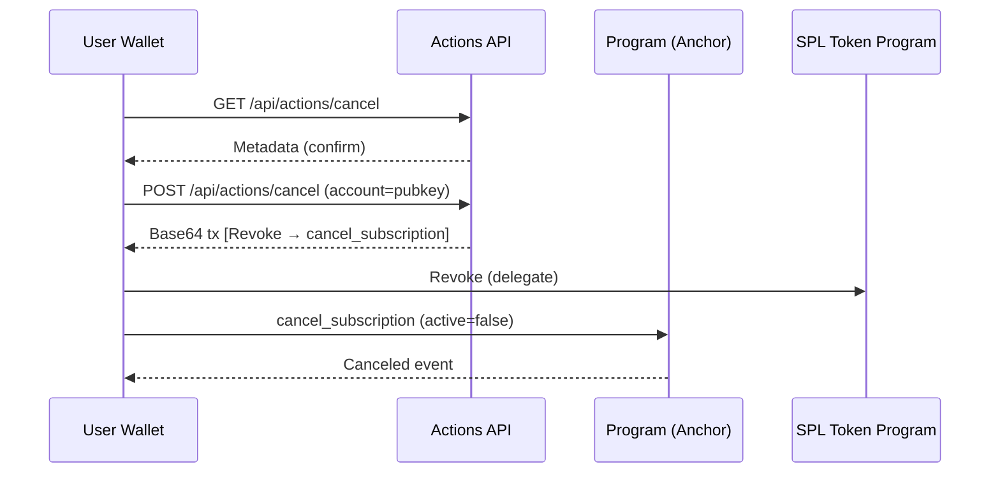

# Product Requirements Document — Blink‑Native Subscriptions (Solo‑Friendly MVP)

**Doc owner:** Roland Rodriguez (Govcraft)
**Date:** 2025‑09‑15
**Status:** Draft v1.0
**Repo:** `solana-subscriptions/` (full layout below)

### Repository layout (authoritative)

```
solana-subscriptions/
├─ README.md
├─ .env.example
├─ Anchor.toml
├─ Cargo.toml                          # workspace
├─ tailwind.config.ts                  # Tailwind v4 setup for HTMX fragments
├─ packages/
│  ├─ idl/                             # generated IDL JSON (build artifact, checked in)
│  ├─ types/                           # shared TS types (Plans, Actions payloads)
│  │  ├─ src/index.ts
│  │  └─ package.json
│  └─ sdk/                             # tiny TS client for Actions + onchain
│     ├─ src/index.ts                  # load IDL/program, PDAs, ATAs, helpers
│     └─ package.json
├─ programs/
│  └─ subs/                            # Anchor program (subscriptions core)
│     ├─ Cargo.toml
│     └─ src/
│        ├─ lib.rs
│        ├─ state.rs                   # Merchant, Plan, Subscription accounts
│        ├─ instructions/
│        │  ├─ init_merchant.rs
│        │  ├─ create_plan.rs
│        │  ├─ start_subscription.rs
│        │  ├─ renew_subscription.rs
│        │  ├─ cancel_subscription.rs
│        │  └─ admin_withdraw_fees.rs
│        └─ events.rs
├─ actions-api/                        # Solana Actions/Blinks server (Rust)
│  ├─ Cargo.toml
│  └─ src/
│     ├─ main.rs                       # tower/axum server bootstrap + HTMX wiring
│     ├─ routes.rs                     # GET/POST handlers for Blink actions + HTMX/Tailwind fragments
│     └─ telemetry.rs                  # tracing subscriber + filters
├─ keeper/                             # off-chain renewals “cron”
│  ├─ Cargo.toml
│  └─ src/
│     ├─ main.rs                       # loop: find_due → renew → backoff
│     ├─ fetch.rs                      # scans PDAs by next_renewal_at
│     ├─ renew.rs                      # builds + sends renew tx
│     └─ metrics.rs                    # Prometheus logs, alerts
├─ cli/                                # quick merchant/dev commands
│  ├─ Cargo.toml
│  └─ src/main.rs                      # init-merchant, create-plan, list, etc.
└─ tests/
   ├─ program.spec.ts                  # mocha/ava e2e in localnet
   └─ keeper.spec.ts
```

**Folder responsibilities**

* **`programs/subs`**: single Anchor program implementing subscription logic using delegate‑based USDC transfers.
* **`actions-api`**: Rust/tower service that serves Actions metadata, HTMX fragments styled with Basecoat + Tailwind v4, and prebuilt transactions.
* **`keeper`**: renewal worker that scans due subscriptions and submits `renew_subscription` in batches.
* **`packages/types`**: canonical TS types for accounts, API payloads, and events.
* **`packages/sdk`**: lightweight client for loading the IDL, computing PDAs/ATAs, and building simple calls.
* **`cli`**: developer/merchant utilities to initialize merchant, create plans, and inspect on‑chain state.
* **`tests`**: program + keeper E2E/localnet tests.
* **HTMX/Basecoat/Tailwind docs**: `htmx-docs.md` captures fragment conventions; Basecoat components live at https://basecoatui.com/, and Tailwind v4 utilities follow the official release guidance.
* **`tailwind.config.ts`**: centralizes Tailwind v4 theme tokens layered over Basecoat primitives for HTMX snippets.

---

## 1) Executive summary (pyramid principle)

Creators and SaaS merchants on Solana need a simple way to sell recurring access without building a full checkout stack. This MVP ships a Blink‑native subscription flow that works anywhere links render: a user taps a Subscribe Blink, approves a bounded USDC allowance, is charged once immediately, and the off‑chain Keeper renews on schedule by pulling from the approved allowance. Cancel is one click via a Cancel Blink. Everything is standards‑based (Solana Actions, SPL Token delegate approvals) and wallet‑friendly. The brand name of the platform is Tally.

We keep the model lean: a single on‑chain program named Tally tracks `Merchant`, `Plan`, and `Subscription` accounts; Actions endpoints compose wallet‑safe transactions (Approve → Start, Revoke → Cancel); a small Rust Keeper (Tally Keeper) renews due subscriptions. V2 can add Token‑2022 membership SFTs or Transfer Hooks, but the MVP delivers value without them.

**Outcome:** A merchant can post a Blink today for “\$5 / 30 days” and collect recurring USDC with clear receipts, low friction, and no custom frontend.

---

## 2) Goals and non‑goals

**Goals**

1. Ship a working end‑to‑end subscription flow (Subscribe, Renew, Cancel) with USDC on Solana using only standard wallet primitives.
2. Provide distribution through Solana Actions/Blinks so merchants can sell from any link surface (X, Discord, websites).
3. Make operations safe and observable: clear events, metrics, and failure handling for renewals and allowance shortfalls.
4. Keep a solo‑maintainable footprint (small program, tiny Actions API, tiny Keeper, shared SDK/types, CLI).

**Non‑goals** (MVP)

* No multi‑chain bridging logic (document CCTP, don’t build).
* No fiat on‑ramp.
* No Token‑2022 membership gating or Transfer Hooks (reserved for V2).
* No complex pricing (no trials/proration/coupons). Single price per plan, fixed period, single mint (USDC).

---

## 3) Users, problems, and use cases

**Primary users**

* **Merchant:** creator, SaaS builder, or community selling recurring access; wants no‑code links, clean receipts, and visibility into failures.
* **Subscriber:** wallet user willing to approve a bounded allowance and revoke anytime; expects one‑tap subscribe/cancel and clear USDC charges.

**Problems today**

* Most on‑chain recurring systems require custom UI or custodial pull models.
* Users dislike opaque debits; merchants struggle with failed renewals tracking.
* Distribution is weak without native link unfurls.

**Use cases**

* Creator posts a “Pro Access \$5/month” Blink across social platforms.
* SaaS CLI unlock using a membership check (off‑chain) that maps to an on‑chain Subscription.
* Private Discord/Telegram access where the bot reads on‑chain state to permit/deny.

---

## 4) Narrative user journeys

**Subscribe**
A user taps a Subscribe Blink → wallet unfurls the Action → GET returns metadata showing plan name and price → POST returns a complete transaction with two instructions: `ApproveChecked` (delegate = program PDA, allowance = 3× price) then `start_subscription` (initial charge and create Subscription). The wallet signs once; the subscription is active and `next_renewal_ts` is set.

**Renew**
The Keeper scans for `active` subscriptions whose `next_renewal_ts` is due and within `grace_secs`. It submits `renew_subscription`. If the allowance or funds are insufficient, it records a failure reason and backs off while still in grace. On success, it bumps `next_renewal_ts` and increments `renewals`.

**Cancel**
The user taps a Cancel Blink. POST returns one transaction with `Revoke` (delegate) and `cancel_subscription` (flag inactive). The program never pulls again.

---

## 5) Full scope and requirements (comprehensive)

This section is complete and self‑contained. It replaces any external checklist.

### 5.1 Prereqs & Tooling (MVP)

* \[MUST] **Toolchain**: Node 18+, pnpm, Rust stable, Anchor ≥ 0.30, Solana CLI ≥ 2.x.
* \[MUST] **Localnet/devnet** workflows documented (`solana-test-validator` with pre‑minted USDC).
* \[MUST] **.env** keys for Actions and Keeper (see §10).
* \[SHOULD] Dockerfile/compose for Actions API; `anchor test` runs headless.
* \[SHOULD] One‑command bootstrap scripts: `pnpm dev:local`, `make localnet-up`.

**Done when**: a clean clone can run the Actions API and hit GET/POST against local validator.

### 5.2 On‑Chain Program (Anchor)

* \[MUST] Instructions: `init_merchant`, `create_plan`, `start_subscription`, `renew_subscription`, `cancel_subscription`, `admin_withdraw_fees`.
* \[MUST] PDAs:

  * **Merchant \[`merchant`, authority]**: `authority`, `usdc_mint`, `treasury_ata`, `platform_fee_bps` (0–1000), `bump`.
  * **Plan \[`plan`, merchant, plan\_id]**: `price_usdc` (u64), `period_secs` (u64), `grace_secs` (u64), `name` (≤32B), `active` (bool).
  * **Subscription \[`sub`, plan, subscriber]**: `next_renewal_ts` (i64), `active` (bool), `renewals` (u32), `created_ts` (i64), `last_amount` (u64), `bump`.
* \[MUST] Event emits: `Subscribed`, `Renewed`, `Canceled`, `PaymentFailed{reason}`.
* \[MUST] **Mint pinning** and strict ATA checks. Classic SPL Token only in MVP.

### 5.3 Instruction Rules & Guardrails

* `init_merchant`: signer = `authority`; `treasury_ata` must match `usdc_mint`; `platform_fee_bps ≤ 1000`.
* `create_plan`: `price_usdc > 0`, `period_secs ≥ 24h`, `grace_secs ≤ 2×period`; immutable price; `active` can be toggled.
* `start_subscription`: requires prior `ApproveChecked` (delegate = program PDA) with allowance ≥ `price × allowance_periods` (default 3). Performs two CPI transfers (merchant, platform), sets `next_renewal_ts = now + period` and emits `Subscribed`. Idempotent within slot.
* `renew_subscription`: valid only when due and within grace; updates timestamps, increments `renewals`, emits `Renewed`. Distinct errors: `InsufficientAllowance`, `InsufficientFunds`, `PastGrace`, `Inactive`.
* `cancel_subscription`: sets `active=false`; emits `Canceled`; no funds moved. The Cancel Blink also posts a SPL `Revoke`.
* `admin_withdraw_fees`: platform authority only; transfers USDC from platform ATA to treasury.

### 5.4 Security Requirements

* Delegate allowance is used **only** inside start/renew; no generic spending.
* Strict seeds/signers; checked arithmetic for fee math (`price*bps/10_000`).
* Idempotency nonce to prevent double charges in same slot.
* Program holds no SOL; transfers are USDC only.

### 5.5 Actions/Blinks API

* Routes: `GET/POST /api/actions/subscribe/:merchant/:plan` and `GET/POST /api/actions/cancel/:merchant/:plan`.
* `actions.json` at root; permissive CORS; responses conform to `@solana/actions` schema.
* POST Subscribe returns a **single** base64 transaction: `ApproveChecked` → `start_subscription` (+ optional `Memo`).
* POST Cancel returns `Revoke` → `cancel_subscription` (+ optional `Memo`).
* Inputs include `{ account: <subscriberPubkey> }`; server computes PDAs/ATAs and detects token program.
* Rate limits + structured errors `{ code, message, hint }`.

### 5.6 Keeper (Renewal Cron)

* Scans `Subscription` PDAs due within grace; batches renewals with bounded concurrency.
* Exponential backoff; reason‑coded failures; optional Jito tips per tx.
* Prometheus metrics: `subs_due_total`, `subs_renew_ok_total`, `subs_renew_fail_total{reason}`, `keeper_loops_total`, `rpc_errors_total`, `tip_lamports_sum`, latency histograms.

### 5.7 SDK & Types

* `/packages/types` for canonical Typescript types.
* `/packages/sdk` for IDL loading, PDA/ATA helpers, token program resolution, memo builders.

### 5.8 CLI

* Commands: `init-merchant`, `create-plan`, `list-plans`, `list-subs`, `deactivate-plan`, `withdraw-fees` with `--json` output.

### 5.9 Data & Fees

* Demo plan: `$5 / 30d` (`price_usdc=5_000_000`, `period_secs=2_592_000`, `grace_secs=432_000`).
* Platform fee taken as a separate transfer each charge; `last_amount` stored for audit.

### 5.10 Config

* Env keys for Actions and Keeper (details in §10) with single source of truth for `PROGRAM_ID`, `USDC_MINT`, treasuries.

### 5.11 Observability & Ops

* JSON logs with `service`, `event`, `plan`, `sub`, `txSig`.
* Grafana dashboard driven by Keeper metrics; alerts on failure rate, RPC spikes, stalled loop.

### 5.12 Testing

* Unit tests for all instruction constraints and error paths.
* E2E localnet test simulating Approve → Start → Keeper Renew → Cancel.
* Property tests for rounding; test matrix for varying allowance/grace/revokes.

### 5.13 Wallet & Blink Compatibility

* Works with at least one top wallet on devnet; tested unfurls in Blinks Inspector and Dialect registry; fallback deep link.

### 5.14 Docs & DX

* README quickstart; “How it works” sequence; revoke instructions; Merchant FAQ.

### 5.15 Risk & Fallbacks

* On `InsufficientAllowance`: emit event + provide Blink to increase allowance.
* On `InsufficientFunds`: record & retry until grace end; then mark failure.
* `Plan.active=false` halts new starts.

### 5.16 Demo DoD

* Merchant/plan created; Subscribe Blink signs one tx; two USDC transfers visible; Keeper renews; Cancel Blink revokes and deactivates.

---

## 6) Detailed functional requirements

**Merchant setup**

* The merchant initializes once: sets authority, USDC mint, merchant treasury ATA, and `platform_fee_bps` (0–1000).
* A merchant can create multiple plans per merchant PDA using deterministic `plan_id` seeds.
* A plan has `price_usdc`, `period_secs`, `grace_secs`, `name`, and `active`. Turning `active=false` stops new starts but does not touch existing subs.

**Start (approve + charge)**

* POST Subscribe must return a single base64 transaction with:

  1. SPL `ApproveChecked` delegating the user’s USDC ATA to the program PDA for `price * allowancePeriods` (default 3).
  2. `start_subscription` that performs two token transfers via CPI as the delegate: `price - fee` to merchant treasury and `fee` to platform treasury.
* The instruction sets `next_renewal_ts = now + period_secs` and emits a `Subscribed` event. Re‑submits within the same slot must not double‑charge.

**Renew**

* Only valid when `now >= next_renewal_ts` and `now <= next_renewal_ts + grace_secs` and `active=true`.
* On success: same split transfer as start; update `next_renewal_ts += period_secs`, `renewals += 1`, `last_amount = price`. Emit `Renewed`.

**Cancel**

* Cancel marks `active=false` and emits `Canceled`. The Cancel Blink also includes a SPL `Revoke` so the delegate is removed in the same transaction.

**Admin withdraw fees**

* Platform authority can move accumulated fees from platform ATA to treasury via `admin_withdraw_fees`.

**Errors and reasons**

* Use distinct program errors for: `InsufficientAllowance`, `InsufficientFunds`, `PastGrace`, `Inactive`, `WrongMint`, `BadSeeds`, and `InvalidPlan`.

---

## 7) APIs (Actions/Blinks) — contract (complete)

### 7.1 Discovery

* Host `actions.json` at the site root with permissive CORS.
* Example `actions.json` (reference template; final headers/syntax come from `@solana/actions`):

```json
{
  "$schema": "https://unpkg.com/@solana/actions/schemas/metadata.json",
  "name": "Blink Subscriptions",
  "actions": [
    { "path": "/api/actions/subscribe/:merchant/:plan", "methods": ["GET","POST"] },
    { "path": "/api/actions/cancel/:merchant/:plan",    "methods": ["GET","POST"] }
  ]
}
```

* CORS: `Access-Control-Allow-Origin: *`, allow `GET, POST, OPTIONS`, allow `content-type`.

### 7.2 Subscribe

* **GET** `/api/actions/subscribe/:merchant/:plan`

  * Returns: metadata object with fields like `title`, `icon`, `description`, and a primary action label (generated via `@solana/actions`).
  * Example response:

```json
{
  "title": "Subscribe to Pro ($5 / 30d)",
  "icon": "https://cdn.example.com/pro-icon.png",
  "description": "USDC recurring subscription handled by a secure delegate.",
  "links": { "actions": [{ "label": "Subscribe", "href": "/api/actions/subscribe/9h.../pro" }] }
}
```

* **POST** `/api/actions/subscribe/:merchant/:plan`

  * Request body:

```json
{ "account": "F7u9...UserWalletPubkey" }
```

* Server responsibilities:

  * Resolve program IDL and PDAs; compute subscriber USDC ATA; detect token program for `USDC_MINT`.
  * Build one transaction with:

    1. SPL `ApproveChecked` delegating allowance = `price_usdc × allowancePeriods` (default 3).
    2. Anchor `start_subscription` instruction.
  * Attach identity `Memo` (e.g., `subs:start:plan=pro`).
* Response body:

```json
{ "transaction": "BASE64_SIGNABLE_TX", "message": "Subscribed to Pro" }
```

### 7.3 Cancel

* **GET** `/api/actions/cancel/:merchant/:plan`

```json
{
  "title": "Cancel Pro subscription",
  "description": "Revokes allowance and deactivates your membership.",
  "links": { "actions": [{ "label": "Cancel", "href": "/api/actions/cancel/9h.../pro" }] }
}
```

* **POST** `/api/actions/cancel/:merchant/:plan`

  * Request body: `{ "account": "<subscriberPubkey>" }`
  * Builds a single transaction: SPL `Revoke` → Anchor `cancel_subscription` (+ `Memo`), and returns base64 payload.

### 7.4 Errors

* All endpoints return structured errors on failure:

```json
{ "code": "NO_USDC_ATA", "message": "Wallet has no USDC account", "hint": "Create ATA then retry" }
```

* Common codes: `NO_USDC_ATA`, `BAD_MERCHANT_OR_PLAN`, `SCHEMA_ERROR`, `BUILD_FAILED`, `RPC_UNAVAILABLE`.

### 7.5 Headers & Limits

* Rate limit suggestions: 60 req/min/IP for GET, 20 req/min/IP for POST.
* Cache: allow GET metadata caching for 60s; never cache POST.

---

## 8) Data model (on‑chain)

**Merchant**

* `authority: Pubkey`
* `usdc_mint: Pubkey`
* `treasury_ata: Pubkey`
* `platform_fee_bps: u16`
* `bump: u8`

**Plan**

* `merchant: Pubkey`
* `plan_id: [u8; ≤32]`
* `price_usdc: u64`
* `period_secs: u64`
* `grace_secs: u64`
* `name: [u8; ≤32]`
* `active: bool`

**Subscription**

* `plan: Pubkey`
* `subscriber: Pubkey`
* `next_renewal_ts: i64`
* `active: bool`
* `renewals: u32`
* `created_ts: i64`
* `last_amount: u64`
* `bump: u8`

**Events**

* `Subscribed { merchant, plan, subscriber, amount }`
* `Renewed { merchant, plan, subscriber, amount }`
* `Canceled { merchant, plan, subscriber }`
* `PaymentFailed { merchant, plan, subscriber, reason }`

---

## 9) KPIs, SLOs, and acceptance criteria

**Business KPIs**

* D1 Subscribe conversion (Blink clicks → signed starts) ≥ 25% for demo funnel.
* Renewal success rate ≥ 95% per cycle for users with allowance ≥ 2× price.
* Cancel flow completion ≤ 2 taps from Blink unfurl.

**Reliability & performance SLOs**

* Actions POST p95 latency ≤ 400 ms (excluding wallet signing).
* Keeper renew throughput ≥ 30 subs/sec on a single core with 64‑item batches.
* Program compute: `start_subscription` ≤ 120k CUs; `renew_subscription` ≤ 90k CUs.
* RPC error rate < 1% over 15m during steady state.

**Acceptance criteria (MVP)**

* A full demo video shows: merchant setup → Subscribe Blink → first charge → Keeper renewal (with simulated time warp) → Cancel Blink.
* Two USDC transfers per charge are visible in the explorer (merchant + platform).
* Metrics dashboard shows due, success, fail with reason codes in near real time.
* Anchor tests cover happy path and each program error.

---

## 10) Constraints and assumptions

* Single chain: Solana; single mint: USDC classic SPL Token (not Token‑2022) for MVP.
* Wallets: at least one major wallet supports Actions/Blinks POST signing.
* Users can revoke allowances anytime; we must make that link easy to find.
* Merchants may use non‑custodial treasuries; the program never holds SOL.

---

## 11) Security and abuse cases

**Threats**

* Over‑broad delegate allowances.
* Wrong‑mint spoofing on ATAs.
* Replay or duplicate starts in a single slot.
* Keeper spam or griefing renewals off‑schedule.
* Malicious merchant fees or bait‑and‑switch pricing.

**Mitigations**

* Default allowance = 3× price; show it in GET metadata; allow smaller values.
* Mint pinning: all transfers check `usdc_mint` stored in Merchant.
* Idempotency: derive a per‑start nonce (e.g., PDA bump or slot stamp) and reject duplicate state transitions.
* Keeper only renews when `now` is within `[next_renewal_ts, next_renewal_ts + grace]`.
* Plan price is immutable; merchants create a new plan for price changes.
* Strong account constraint macros; checked arithmetic; narrow CPI scopes.

**Privacy**

* No PII on‑chain; Actions server must not log wallet addresses beyond analytics samples without opt‑in.
* Prometheus labels avoid raw pubkeys except where needed to debug.

---

## 12) Observability and ops

* Structured JSON logs across Actions and Keeper with `service`, `event`, `plan`, `sub`, `txSig`.
* Prometheus metrics from Keeper: `subs_due_total`, `subs_renew_ok_total`, `subs_renew_fail_total{reason}`, `latency_ms_bucket`, `rpc_errors_total`, `tip_lamports_sum`.
* Grafana dashboard panels for active subs, MRR (derived), renewal rate, failure reasons, and Keeper health.
* Alerts: renewal fail rate > 5% over 15m; Keeper loop stalled > 2m; RPC error spike > 3% over 10m.

---

## 13) Testing strategy

* **Unit:** program constraints, error codes, rounding checks.
* **E2E localnet:** Approve → Start → Keeper Renew → Cancel with supertest against Actions API; explorer assertions for two USDC transfers.
* **Property tests:** fee math and amount bounds.
* **Chaos:** intermittent RPC failures; delayed Keeper; allowance set to 1×, 0.5×; revoked delegate mid‑grace.

---

## 14) Rollout plan

**Phase 0 — Local/devnet**

* Deploy program to localnet; wire Actions API; run Keeper with metrics; record demo.

**Phase 1 — Devnet public demo**

* Publish Subscribe/Cancel Blinks; test with at least two wallets; measure conversion and renewal.

**Phase 2 — Mainnet canary**

* Small cohort merchant; alerting on; Jito tips optional; keep price low with explicit allowance text.

Go/No‑Go checks: test coverage ≥ 80%; keeper dashboard stable; Actions p95 ≤ 400 ms; no critical audit blockers in a focused self‑review.

---

## 15) Open questions and decisions to make

1. **Allowance default:** 2× vs 3× periods? We favor 3× for fewer re‑approvals but can start at 2×.
2. **Jito tips:** off by default or minimal default (e.g., 5k lamports) for renewal reliability?
3. **Memo format:** standardize action identity memos for analytics.
4. **Wallet matrix:** which wallets are must‑have for devnet demo?
5. **Dashboard:** include a tiny read‑only Next.js dashboard in MVP or defer to V2?

---

## 16) Future extensions (V2+)

* Token‑2022 SFT membership with freeze on cancel, or Transfer Hook for on‑chain gating.
* Multiple stablecoins or SOL‑denominated pricing with oracle smoothing.
* Trials, proration, coupons, and metered usage.
* Jito bundle submissions and priority fee tuning API.
* Merchant web dashboard with webhook integrations and CSV exports.

---

## 17) Appendix — definition of done (demo)

* Merchant created with `fee_bps=50`; plan `pro` at `$5/30d`; Subscribe Blink posted.
* User signs one transaction with `ApproveChecked` + `start_subscription` and sees a success message.
* Two USDC transfers visible; `next_renewal_ts` set; Keeper renews after simulated period.
* Cancel Blink revokes delegate and flags subscription inactive.
* Metrics and logs show each step with consistent identifiers.

---

## 18) Bootstrap & runbook (copy/paste)

### 18.1 Prereqs

* Install Node 18+, pnpm, Rust stable, Anchor ≥ 0.30, Solana CLI ≥ 2.x.
* `solana config set --url localhost` (for localnet) or devnet as needed.

### 18.2 Localnet USDC setup

```bash
solana-test-validator --reset --limit-ledger-size \
  --bpf-program <placeholder> <placeholder> &
# In a new shell:
USDC_MINT=$(spl-token create-token --decimals 6 | awk '/Creating token/ {print $3}')
USDC_ATA=$(spl-token create-account $USDC_MINT | awk '/Creating account/ {print $3}')
spl-token mint $USDC_MINT 1000000000   # 1,000 USDC to your default keypair
```

### 18.3 Build & deploy program

```bash
anchor build
anchor deploy
PROGRAM_ID=$(solana address -k ./target/deploy/subs-keypair.json)
```

Export `.env` for Actions and Keeper using values above.

### 18.4 Merchant & plan via CLI

```bash
# Merchant treasury ATA for your USDC mint
MERCHANT_TREASURY=$(spl-token create-account $USDC_MINT | awk '/Creating account/ {print $3}')
# Init merchant (50 bps = 0.5%)
cargo run -p cli -- init-merchant \
  --authority $(solana address) \
  --usdc $USDC_MINT \
  --treasury $MERCHANT_TREASURY \
  --fee-bps 50
# Create $5 / 30d plan with 5d grace
cargo run -p cli -- create-plan \
  --merchant <MERCHANT_PDA> \
  --id pro \
  --price 5000000 \
  --period 2592000 \
  --grace 432000
```

### 18.5 Actions API

```bash
export RUST_LOG=info
cargo run -p actions-api
# ensure SSL termination / CORS when fronting with nginx or fly.io
```

* Subscribe Blink URL format:

```
https://dial.to/?action=<url-encoded solana-action:https://YOURDOMAIN/api/actions/subscribe/<merchant>/<plan>>
```

* HTML snippets use HTMX for interactivity with Basecoat + Tailwind v4 styling; reference `htmx-docs.md`, https://basecoatui.com/, and Tailwind v4 docs when extending UI responses.
* Blink unfurls consume the Actions spec directly, so frontends can stay in Rust/HTML with HTMX—TypeScript helpers are optional.

### 18.6 Keeper

```bash
export RPC_URL=http://127.0.0.1:8899
export PROGRAM_ID=$PROGRAM_ID
export USDC_MINT=$USDC_MINT
export PLATFORM_USDC_TREASURY=<YOUR_PLATFORM_USDC_ATA>
export JITO_TIP_LAMPORTS=0
export RENEW_BATCH_SIZE=64
export RETRY_BACKOFF_SECS=900
cargo run -p keeper
```

### 18.7 Demo validation

* Post Subscribe Blink → sign one tx → verify two USDC transfers (merchant/platform) in explorer.
* Warp time or tweak clock in tests → Keeper renews → balances update.
* Post Cancel Blink → revoke + deactivate.

---

## 19) Sequence diagrams (reference)

**Subscribe (Approve → Start)**

```mermaid
sequenceDiagram
    participant U as User Wallet
    participant A as Actions API
    participant P as Program (Anchor)
    participant T as SPL Token Program
    U->>A: GET /api/actions/subscribe/:merchant/:plan
    A-->>U: Metadata (title, price, labels)
    U->>A: POST /api/actions/subscribe (account=pubkey)
    A-->>U: Base64 tx [ApproveChecked → start_subscription]
    U->>T: ApproveChecked (delegate=PDA, amount=price×N)
    U->>P: start_subscription (CPI TransferChecked to merchant+platform)
    P-->>U: Subscribed event; next_renewal_ts set
```

**Cancel (Revoke → Cancel)**



---

## 20) Program errors (canonical)

* `InsufficientAllowance` (1001)
* `InsufficientFunds` (1002)
* `PastGrace` (1003)
* `Inactive` (1004)
* `WrongMint` (1005)
* `BadSeeds` (1006)
* `InvalidPlan` (1007)

Each error is unit‑tested and surfaced in Actions responses with remediation hints.
